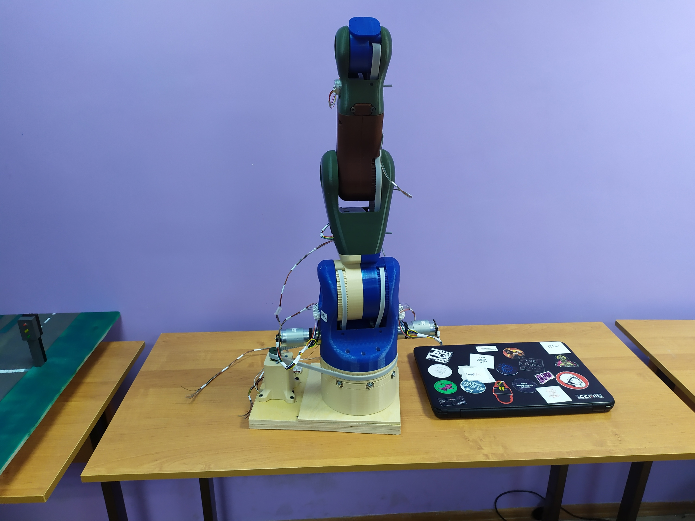

# volcaano-arm

The project is forked from [MOVEO by BCN3D](https://www.bcn3d.com/bcn3d-moveo-the-future-of-learning/).



## Documentation

[system block diagram](docs/system.md)

## Folder description

```
volcaano-arm
│   README.md    
│
└───controller
│   │   control
│   │   drivers
│   │   network
|
└───host
    │   drivers
    │   tools
```

`controller` has all source code regarding the controller firmware (currently Arduino). `control` has position and velocity regulator implementations. `network` has functions regarding controller-host communication. `drivers` implement feedback acquisition and control signals for sensors and actuators.

`host` has all source code regarding the high-level GUI application, which is running on x64-x86 PC (Windows or hopefully Linux). `drivers` help to communicate with external world, has API to control the roboarm's controller as well. `tool` consist of developer and other helpful utilities.