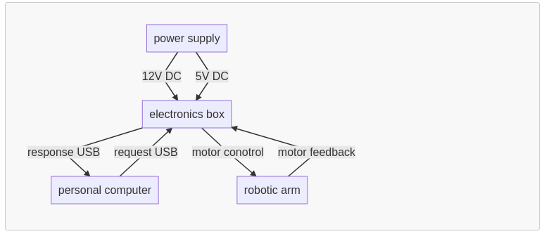
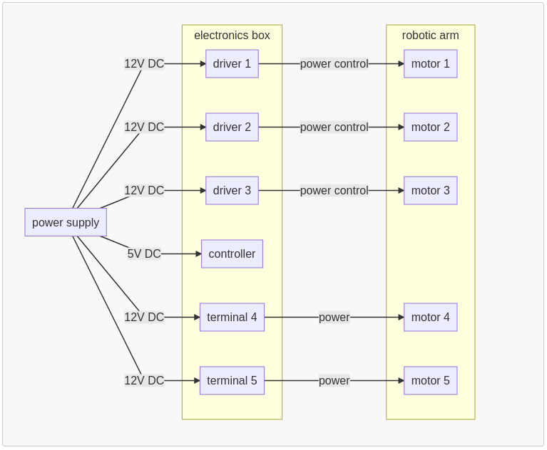
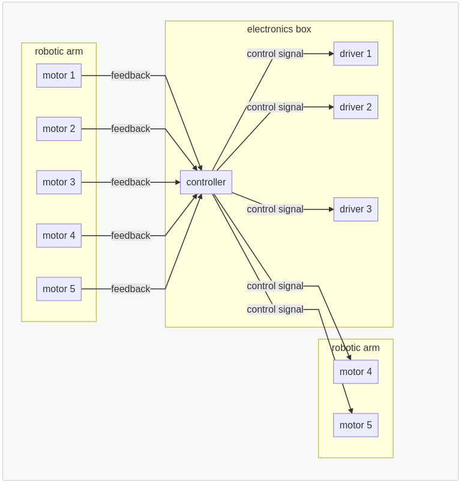
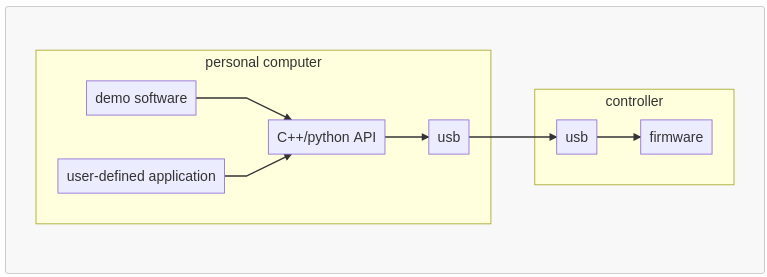
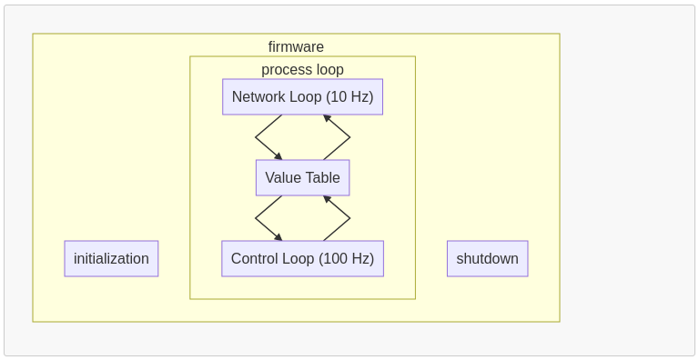
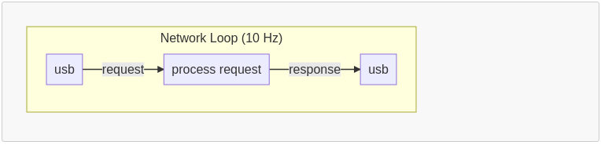
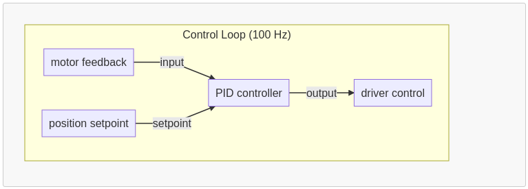

# System block diagram

## Power block diagram

## Control Signal block diagram

## Software block diagram

### Firmware

#### Network Loop (10 Hz)

Supported requests:
* **GetMotorState (MotorNumber)**
    * Position (rad)
    * Velocity (rad/s)
    * Acceleration (rad^2/s)
* **SetMotorSetpoint (MotorNumber, PositionSetpoint)**
* **GetMotorPID**
* **SetMotorPID**
* SendNewTrajectory
* GetTrajectoryState
* ExecuteTrajectory
* AbortTrajectory
* SetLogLevel
* **GetLogMsgs**

#### Control Loop (100 Hz)

